# Phylogeography in BEAST

## Introduction

The aim of this tutorial is to introduce you to the methods I used to infer zoonotic transmission in *Campylobacter*. Here we will use the H1N1 influenza example dataset distributed with BEAST, as it is much more manageable for a tutorial than the *Campylobacter* data! I will try to make link the steps here to what I did in my study.  

This tutorial was forked from Simon Frost's [version](https://github.com/sdwfrost/influenza-dynamics-practical-h5n1) of Trevor Bedford's [excellent tutorial on pandemic H1N1 influenza](https://github.com/trvrb/influenza-dynamics-practical). Any mistakes and opinions introduced are mine.

## Required software

* [BEAST](http://beast.bio.ed.ac.uk/) is used to infer evolutionary dynamics from sequence data.
* [BEAGLE](http://beast.bio.ed.ac.uk/BEAGLE) is a helper library that allows faster and more advanced functions to be run in BEAST. For this practical, it is not necessary to install CUDA drivers (step 2 in the BEAGLE installation).
* [Tracer](http://tree.bio.ed.ac.uk/software/tracer/) is used to analyze parameter estimates from BEAST.
* [FigTree](http://tree.bio.ed.ac.uk/software/figtree/) is used to analyze phylogeny estimates from BEAST.
* [Google Earth](http://www.google.com/earth/) is used to display phylogeographic reconstructions.
* [Phylowood](http://mlandis.github.io/phylowood/) is a browser-based platform for phylogeographic reconstructions.

In addition, [R](http://www.r-project.org) and [Ruby](http://www.ruby-lang.org) are used for some basic data processing tasks. As I've already processed the data, you don't need to install these unless you want to use them routinely.

## Compile sequence data

This practical uses a test dataset of haemagglutinin sequences of H5N1 influenza (n=98) from 7 locations, as distributed with [BEAST](http://beast-mcmc.googlecode.com/svn/trunk/examples/release/discreteTraits/H5N1_HA.nex). Although BEAST accepts either [NEXUS](http://en.wikipedia.org/wiki/Nexus_file) or [FASTA](http://en.wikipedia.org/wiki/FASTA_format) format for sequence data, I converted the original NEXUS dataset into FASTA, as this is probably the most common sequence format to start with. The final aligned dataset can be found at `data/H5N1_HA.fas`.

Metadata about the date of sampling is incorporated into the sequence name, while location is kept as a separate tab-delimited file (`data/H5N1_locs.txt`).

## Prepare a phylogeographic analysis

The program BEAST takes an XML control file that specifies sequence data, metadata and also details the analysis to be run.
All program parameters lie in this control file.
However, to make things easier, BEAST is distributed with the companion program BEAUti that assists in generating the XML.
Here, we will produce an XML that specifies a "skyride" analysis, in which we estimate changes virus population size through time, and a discrete trait model for modeling geographic spread.

**Open BEAUti.**

This will show a window with the 'Partitions' panel open.
We first need to load the sequence data.

**Click on the '+' or choose 'Import Data...' from the File menu and select `H5N1_HA.fas`.**

This will load a data partition of 98 taxa and 1698 nucleotide sites.

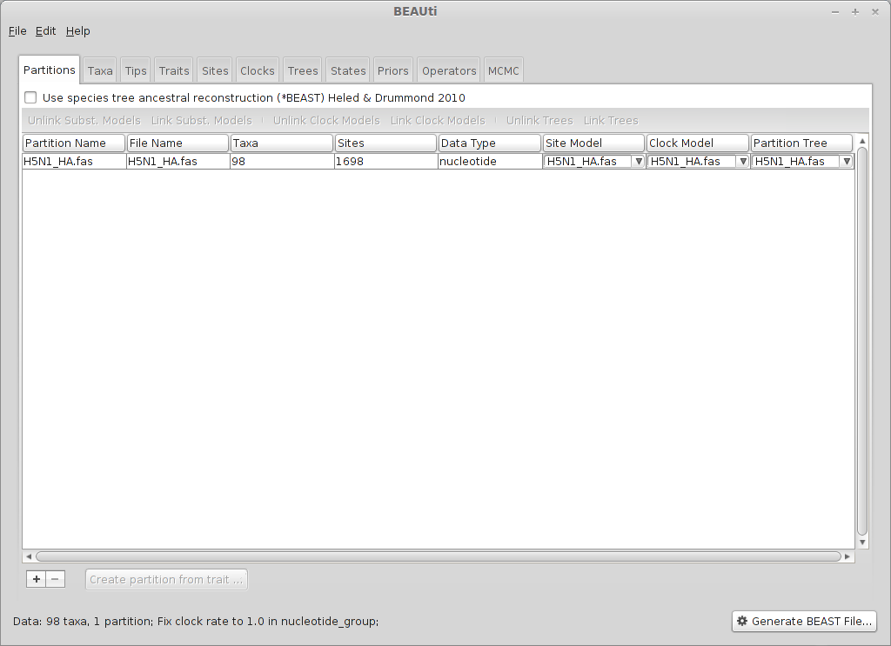

Double-clicking the partition will open a window showing the sequence alignment.
It's good to check to make sure the alignment is in order.

We next label each taxon with its sampling date.

**Select the 'Tips' panel, select 'Use tip dates' and click on 'Guess Dates'.**

We need to tell BEAUti where to find the tip dates in the taxon names.
Here, each taxon name ends with its year of sampling separated by an underscore.

**Select 'Defined just by its order'.**

**Select 'Order' equals 'last' and input `_` for 'Prefix'.**

**Select 'Parse as a number'.**


This will result in the 'Date' and 'Height' columns filing the the date forward from the past and the height of each taxon relative to the most recent taxon.

**Click on 'Date' twice to sort rows in reverse.**

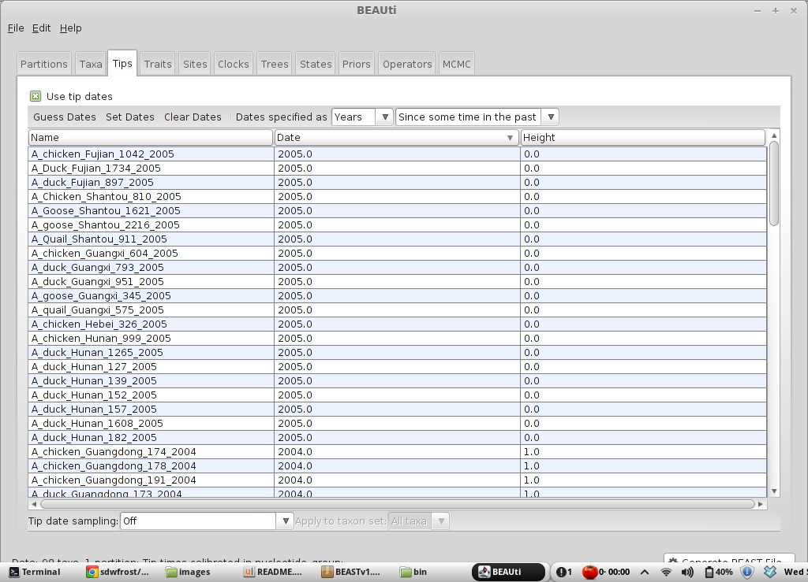

It will be helpful for later to record that the most recent tip has a date of `2005`. The sampling times provided here are rather coarse (year only); a more thorough analysis would involve enabling 'Tip date sampling', and specifying a range of sampling dates for each sequence.

Next, we need to specify a model of the process by which nucleotide sites evolve.

**Select the 'Sites' panel.**

BEAUti only allows nucleotide models to be specified. We will use a fairly widely used model - the general time reversible (GTR) model, estimating base frequencies and specifying rate distribution as a mixture between a gamma distribution (discretized into four categories) and 0 (invariant sites). A model selection procedure prior to running BEAST (e.g. in [Datamonkey](http://www.datamonkey.org)) may help to guide this choice.

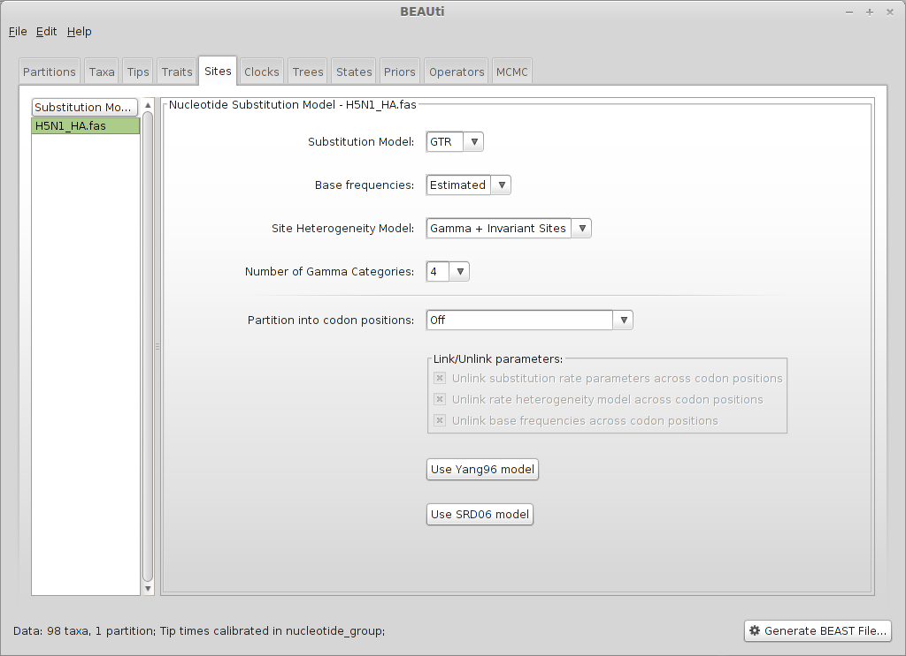

Next, we need to specify a molecular clock to convert between sequence substitutions and time.

**Select the 'Clocks' panel.**

We choose a relaxed molecular clock in which substitutions occur at the different (uncorrelated lognormal) rates across branches in the phylogeny.

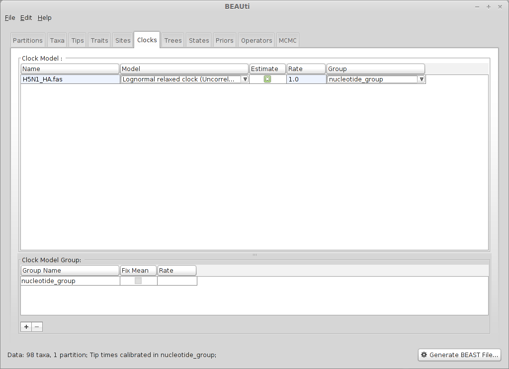

Next, we need to specify a model that describes phylogenetic structure based on some underlying demographic process.

**Select the 'Trees' panel.**

Here, we will choose a model that describes how the virus population size changes through time.
There are parametric models that assume some basic function (like exponential growth) and there are non-parametric models that don't make any strong assumptions about the pattern of change.
We begin by choosing a non-parametric model.

**Select 'Coalescent: GMRF Bayesian Skyride' from the 'Tree Prior' dropdown and 'Time-aware' from the 'Smoothing' dropdown.**

This model assumes a fixed number of windows, where within each window effective population size is constant, and estimates are smoothed using a Gaussian Markov Random Field. We start with a UPGMA initial tree.

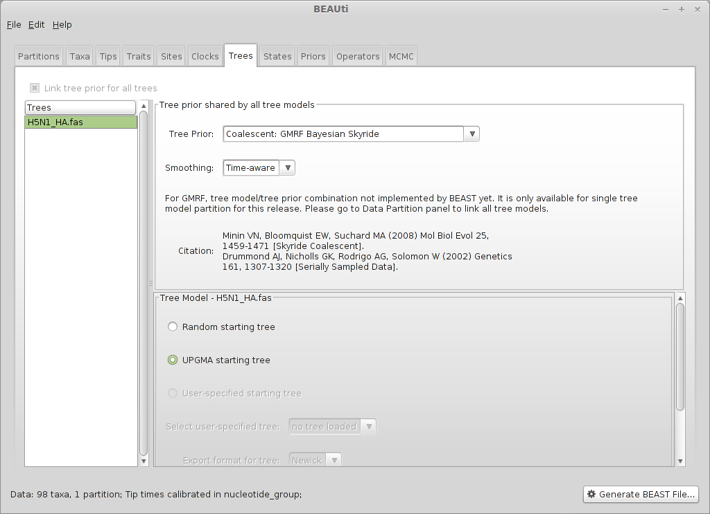

Generally, these non-parametric models offer flexibility for the data to say what it wants to say. However, these are relatively complex models and so suffer from the [bias-variance tradeoff](http://scott.fortmann-roe.com/docs/BiasVariance.html). This often results in wide bounds of uncertainty to the resulting estimates.

We next need to load the geographic metadata into BEAUti (host species in the zoonotic model).

**Select the 'Traits' panel and click on the 'Add trait' button.**

**In the resulting dialog, select 'Import trait(s) from a mapping file and press 'OK'.**

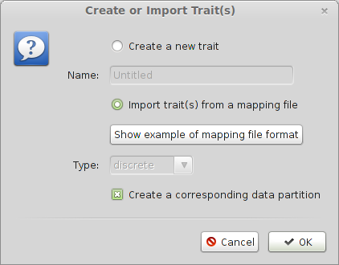

Select the `data/H5N1_locs.txt` file. Doing so results in a discrete trait being associated with each taxon.

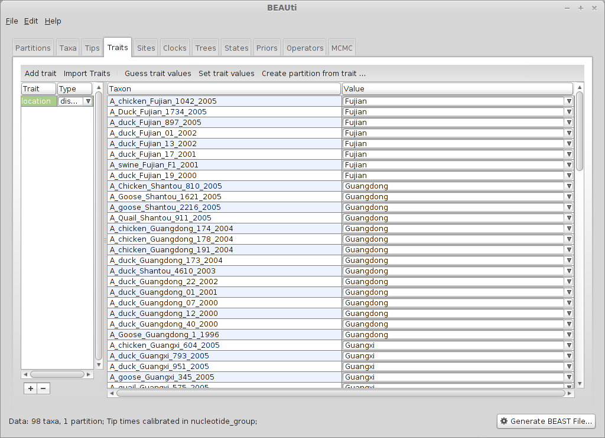

BEAST treats location like just another trait. We have to generate a new data partition from this trait in order to use it in the analysis.

**Select the partition so it appears in the window, then press 'Create partition from trait'.**

We next need to give a model for how each location character state transitions to other location character states.

**Select the 'Sites' panel and click on 'location' in the left-hand list of data partitions.**

We will use a 'Symmetric substitution model' where the rate that A goes to B equals the rate that B goes to A.
Although the asymmetric model seems like it should better match reality, using it adds significant parameter complexity and additionally sacrifices a fair degree of robustness to sampling particulars.

**Select 'Infer social network with BSSVS'.**

BSSVS stands for Bayesian Stochastic Search Variable Selection.
It adds an indicator variable for each pairwise transition rate that specifies whether the rate is on or off, i.e. at its estimated value or at 0.
These indicators serve to decrease the effective number of rate parameters that need to be estimated and are helpful to include when trying to infer a sparse transition matrix.

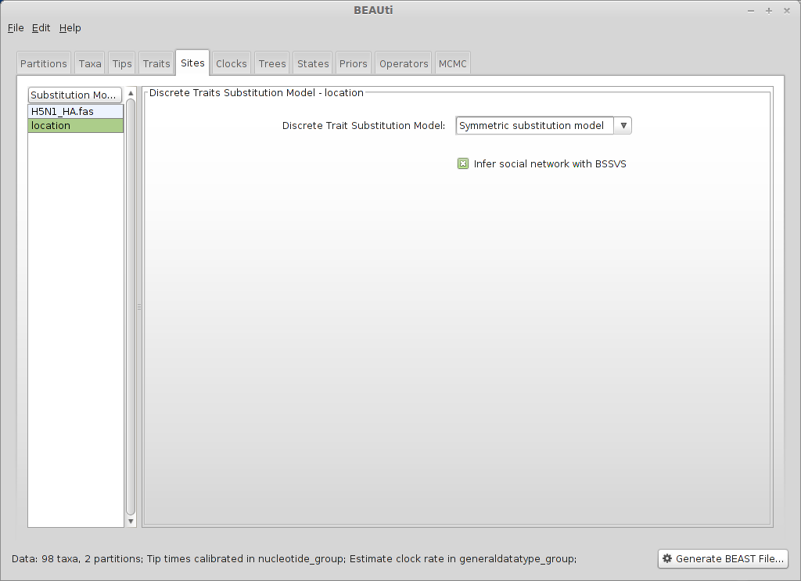

As with the sequence partition, we also need to include a model of how geographic transition rate relates to time.

**Select the 'Clocks' panel.**

We will stick with the default 'Strict clock' for transitions among geographic locations.

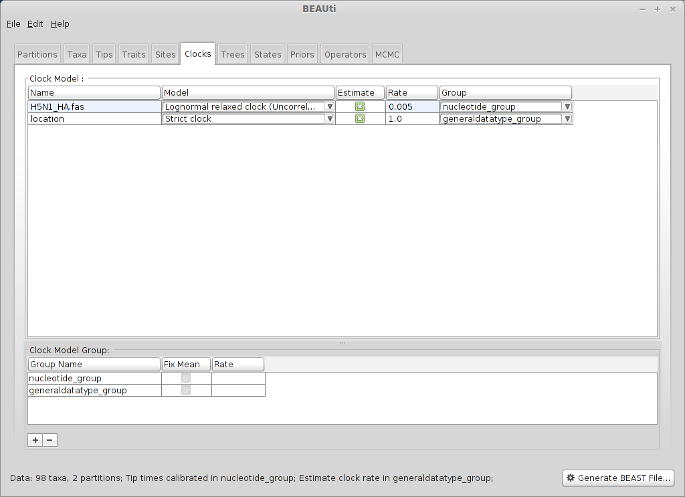

**Select the 'Trees' panel.**

We don't need to do anything here, because the sequences and the geographic locations are based on the same underlying evolutionary tree.

**Select the 'States' panel and click on 'location' in the left-hand list of data partitions.**

In addition to reconstructing states at all ancestors, we are particularly interested in where in the world the pandemic emerged.

**Select 'Reconstruct states' at 'Tree Root' (in addition to 'Reconstruct states at all ancestors', which should already be checked).**

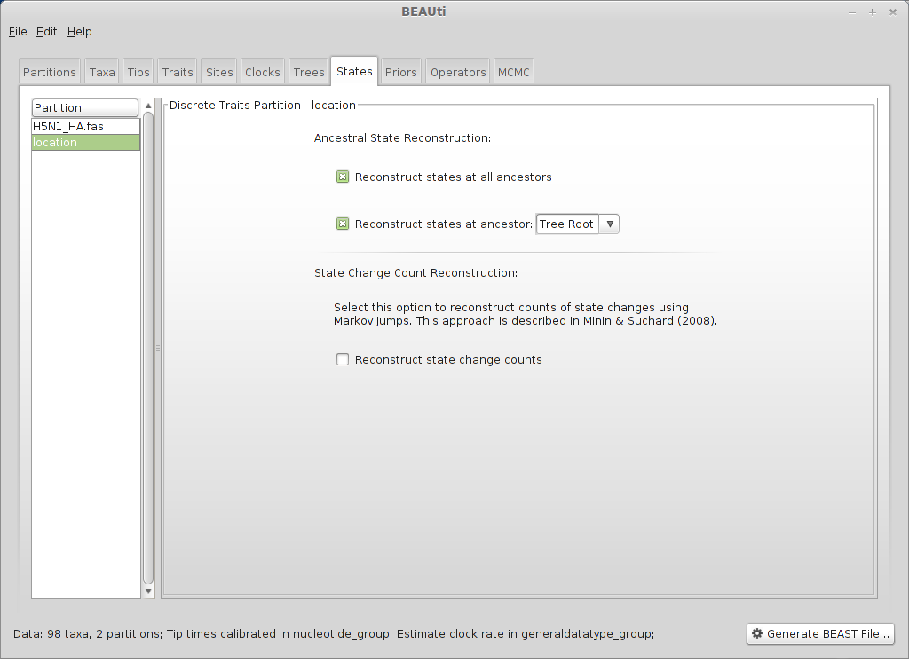

Next, we need to specify priors for each parameter in the model.

**Select the 'Priors' panel.**

Specifying priors can be difficult, especially when there may be little prior information available. If there are sufficient data available, then the results will be fairly insensitive to priors. In this case, we leave most of the priors at their default values.

However, we are forced to choose a prior for the evolutionary rate, which in the uncorrelated lognormal relaxed clock is ucld.mean.

**Click on the prior for 'ucld.mean' (currently highlighted in red).**

Although including improper priors will not harm parameter estimates, it will adversely impact the ability to do model comparison, and so it is not recommended. Here, we use a 'vague' prior on 'ucld.mean', choosing uniform between 0 and 1.

**Select 'Uniform' from the 'Prior Distribution' dropdown.**

**Enter `0.0` as a lower-bound and `1.0` as an upper bound.**

We actually have a good expectation from knowledge of influenza mutation rates that 'clock.rate' should be near 0.005.
We include this as an initial value to aid convergence.

**Enter `0.005` as an 'Initial value'.**

After setting this, the 'ucld.mean' prior no longer shows as red.

We need to give a prior to the overall geographic transition rate.

**Select the 'location.clock.rate' prior and choose 'Exponential' from the dropdown.**

We will leave mean and initial value set to 1.0.

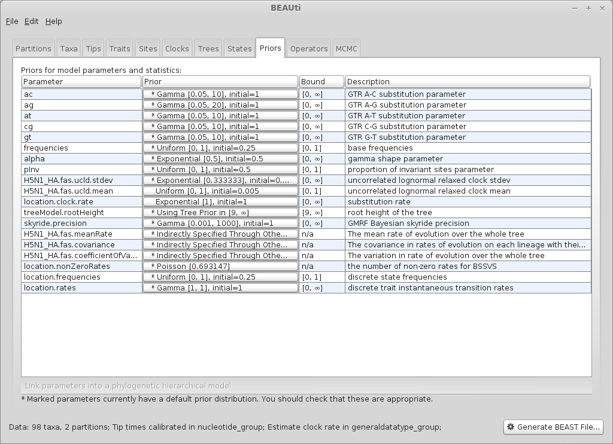

Next, we need to specify operators (or proposals) for the [MCMC](http://en.wikipedia.org/wiki/Markov_chain_Monte_Carlo) sampler.

**Select the 'Operators' panel.**

Good proposals will make the MCMC more efficient and poor proposals will lead to MCMC inefficiency and longer run times.
In this case, we stick with the default list of operators.

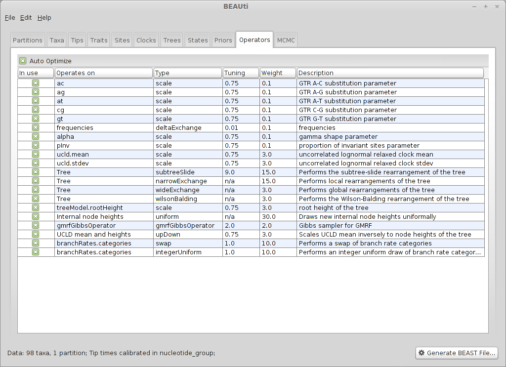

Following a run, BEAST may suggest changes to these operators in order to make further runs more efficient.

Next, we need to specify how often and where MCMC samples are logged to.

**Select the 'MCMC' panel.**

Generally, larger datasets will require longer chains and less frequent sampling. This example will aim for 2000 samples, planning to throw out the first 500 or 1000 as [burn-in](http://en.wikipedia.org/wiki/Burn-in). The effective sample size will depend on the amount of autocorrelation in the Markov Chain, and will vary depending on the parameter.

**Enter `50000000` (50 million) for 'Length of chain'.**

**Enter `25000` for 'Log parameters'.**

**Enter `H5N1_HA_skyride_ucld_discrete` for 'File name stem'.**

**Also check the 'Create operatory analysis file'.**

This will result in 2000 samples logged to the files `H5N1_HA_skyride_ucld_discrete.log` and `H5N1_HA_skyride_ucld_discrete.trees`.

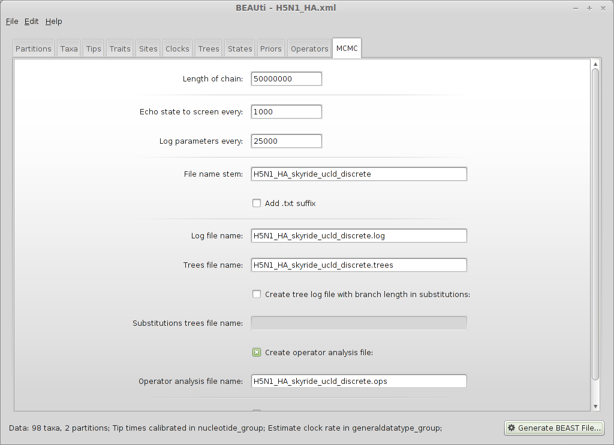

We save the XML control file in BEAUti, so we don't have to repeat all the steps.

**Choose 'File', then 'Save as' to save the model specification (saved under `xml/H5N1_HA.xml`). This is *not* the same as the BEAST file.**

Finally, we generate the file for BEAST.

**Click on 'Generate BEAST File...'**

**Select Continue when shown the priors.**

**Save the XML as `H5N1_HA_skyride_ucld_discrete.xml`.**

For the most part, BEAUti does a good job creating an XML optimized for the analysis at hand. However, there may be small details that need to be cleaned up by hand, or the models may not be able to be specified in BEAUti.

**Open `H5N1_HA_skyride_ucld_discrete.xml` in a text editor.**

XML is structured in a hierarchical fashion with logical blocks of markup surrounding by open (`<block>`) and close (`</block>`) tags.

**Find the XML block that specifies tree output called 'logTree'.**

```
<logTree id="treeFileLog" logEvery="25000" nexusFormat="true" fileName="H5N1_HA_skyride_ucld_discrete.trees" sortTranslationTable="true">
			<treeModel idref="treeModel"/>
			<trait name="rate" tag="H5N1_HA.fas.rate">
				<discretizedBranchRates idref="H5N1_HA.fas.branchRates"/>
			</trait>
			<trait name="rate" tag="location.rate">
				<strictClockBranchRates idref="location.branchRates"/>
			</trait>
			<posterior idref="posterior"/>

			<!-- START Ancestral state reconstruction                                    -->
			<trait name="location.states" tag="location">
				<ancestralTreeLikelihood idref="location.treeLikelihood"/>
			</trait>

			<!-- END Ancestral state reconstruction                                      -->

		</logTree>
```

**Delete the 'trait' block for the tag 'location.rate' that contains 'strictClockBranchRates'.**

```
<logTree id="treeFileLog" logEvery="25000" nexusFormat="true" fileName="H5N1_HA_skyride_ucld_discrete.trees" sortTranslationTable="true">
			<treeModel idref="treeModel"/>
			<trait name="rate" tag="H5N1_HA.fas.rate">
				<discretizedBranchRates idref="H5N1_HA.fas.branchRates"/>
			</trait>
			<posterior idref="posterior"/>

			<!-- START Ancestral state reconstruction                                    -->
			<trait name="location.states" tag="location">
				<ancestralTreeLikelihood idref="location.treeLikelihood"/>
			</trait>

			<!-- END Ancestral state reconstruction                                      -->

		</logTree>

```

This fine-tuning of the XML can be quite helpful and there are quite a few more advanced analyses that require editing the XML rather than relying on BEAUti output. For the *Campylobacter* data, I added an ambiguity code to allow the human isolates to have an ‘unknown’ source population. For each human isolate, the other host species in the analysis were given equal prior probability and thus most likely source of the human isolates could be inferred. This is edited in to the BEAST xml file by adding an `<ambiguity>` to the `<generalDataType>` as in the example below, where state 9 can be inferred to be either of states 1 or 2:
```
<generalDataType id="host.dataType">
	<!-- Number Of States = 2 -->
	<state code="1"/>
	<state code="2"/>
	<ambiguity code="9" states="12"/>
</generalDataType>
```

I've included this XML with the practical as `xml/H5N1_HA_skyride_ucld_discrete.xml`.

## Run the analysis

This XML file contains all the information that BEAST requires.

### Running BEAST from a GUI
 
**Open BEAST.**

**Click on 'Choose File...' and select `H5N1_HA_skyride_ucld_discrete.xml`.**

By default, BEAST will have 'Allow overwriting of log files' turned off, so that you can't accidentally overwrite a previous run's output.
However, you'll often need to check this box when there are previous log files in the same directory that should be overwritten.

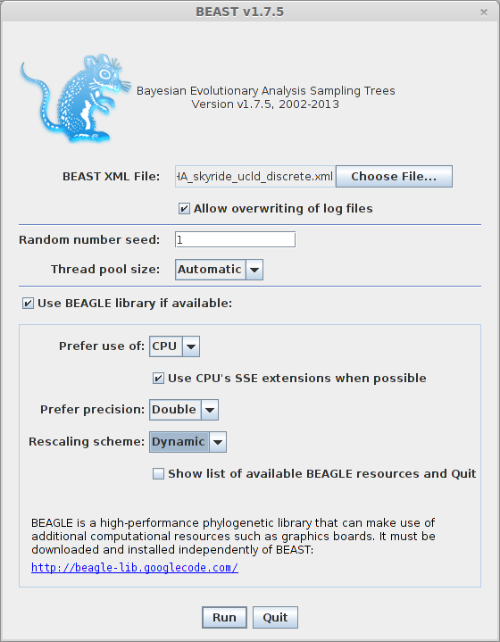

BEAGLE is turned off by default.
BEAGLE is an additional Java library that contains high-performance code to compute evolutionary likelihoods on phylogenetic trees.
Most of the BEAST analyses will work on the built-in BEAST engine.
However, some of the newer analyses will require BEAGLE.
In this case, we can leave it unchecked or checked as desired. The scaling is to avoid numerical underflow, which can be a problem with large datasets. Although BEAGLE can work with graphics processing units, it can also use the CPU, so it can accelerate the analysis on most 

**Click on 'Run'.**

This will start the BEAST run and log MCMC setup and progress to a window. Additionally, the log and trees files will start to fill with MCMC samples.

Unfortunately, BEAST runs can take quite a long time, and it's not always clear how long they need to run.

Because of these time requirements, I almost never run BEAST analyses locally, preferring instead to get the XML up and running and tested locally and then running BEAST on a cluster node to perform the full analysis.

### Running BEAST from the command line

On Linux, I would run BEAST using a command line interface; the specifics would vary depending on your setup. I usually run 'screen' or 'tmux' first, as BEAST runs can take a long time, and the likelihood of the connection breaking to the server is high.

The following lists all the command line options.

```
/home/simon/Programs/BEASTv1.7.5/bin/beast --help 
```

Here is a full example command line on my machine.

```
java -Xms64m -Xmx1024m -Djava.library.path="/home/simon/Programs/BEASTv1.7.5/lib:/home/simon/lib:/usr/local/lib" -cp "/home/simon/Programs/BEASTv1.7.5/lib/beast.jar:/home/simon/Programs/BEASTv1.7.5/lib/beast-beagle.jar" dr.app.beast.BeastMain -working -seed 1 -threads 8 -beagle -beagle_CPU -beagle_SSE -beagle_double -beagle_scaling dynamic H5N1_HA_skyride_ucld_discrete.xml
```

### Output

On my (not very fast) Mac, it takes about one hour for six million steps of the Markov chain, i.e. around 8-9 hours to run. In part, this is because the model is quite complex. As you may not have time to run these files yourself in a hands-on practical session, I've included the resulting log files and trees file in the practical in the `output` directory.

At the end of the BEAST run, you'll see some information regarding how the run went - this will be saved as as `H5N1_HA_skyride_ucld_discrete.ops` if you checked the 'Create operator analysis file' in BEAUti. This will tell you where BEAST spent most of its time, as well as the acceptance probabilities. As a guide, the optimal acceptance rate for an infinite number of distributions that are IID and Gaussian is 0.234 or 23.4%; note how the substitution parameters fall (surprisingly) close to this (probably due to the central limit theorem), whereas the wide exchange and Wilson-Balding tree proposals are rarely accepted (see [here](http://ieeexplore.ieee.org/xpl/articleDetails.jsp?arnumber=4696663) for a discussion of these moves). Given that these proposals quite drastically change the tree, it isn't surprising that these have a low acceptance; the cost of this inefficiency is that tree space is explored more widely. If the acceptance rate is too high, then whilst many changes are being accepted, they may be too small, and hence the Markov chain may not be mixing well either.

## Examine the skyride output

Here, we begin by looking at estimated parameter values from the skyride analysis. As BEAST assumes that the effective population size is independent of the subpopulation (a questionable assumption), this visualisation is the same, regardless of whether we have phylogeography or not.

**Open Tracer.**

Tracer is designed to take a tab-delimited file in which each line represents a separate MCMC sample.

**Click '+' and select 'H5N1_HA_skyride_ucld_discrete.log' from the resulting dialog.**

This displays each parameter as a separate element in the 'Traces' list.
First off, we need to assess whether the MCMC has converged to its stationary distribution.
The simplest way to do this is to look at MCMC state through time.

**Select 'posterior' from the list of 'Traces' and select the 'Trace' panel on the right.**

This shows the posterior log probability of the model given the data for each step in the MCMC chain.

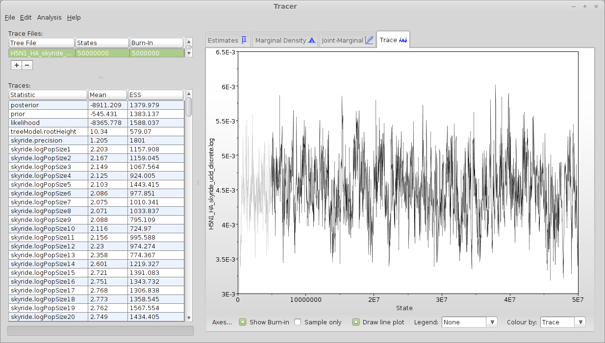

The MCMC chain starts out in a poor configuration, but eventually converges on the correct stationary distribution; because of this, the initial steps in the MCMC need to be discarded as 'burn-in'. Here, it looks like the default 10% are sufficient for burn-in. If it looked as though a longer burn-in is needed, you can edit the field for 'Burn-in' on the top left.

It's good to check other parameters to confirm that their values appear to have burnt-in as well.

There are more rigorous ways to assess burn-in (all of which are somewhat empirical), but we will stick with this simple eye-ball-the-trace method for the practical.

After burn-in each sample from the MCMC represents a sample from the posterior distribution of model parameters given the data.
For instance, we can look at estimates of TMRCA across the MCMC

**Select 'treeModel.rootHeight' from the list of 'Traces' and select the 'Estimates' panel on the right.**

This shows the distribution of posterior values of TMRCA.
The mean estimate is 10.34 years back from 2005, so 1994.66.
However, other estimates are also consistent with the data.
The 95% credible interval (the Bayesian analogue - not homologue - of the confidence interval) lies between 9.63 and 11.06 years, so between 1993.92 and 1995.37.

These estimates correspond to the following calendar dates, which I calculated in R using the [lubridate](http://cran.r-project.org/web/packages/lubridate) library:

```
 > library(lubridate)
> date_decimal(1993.92)
[1] "1993-12-02 19:12:00 UTC"
> date_decimal(1994.66)
[1] "1994-08-29 21:36:00 UTC"
> date_decimal(1995.37)
[1] "1995-05-16 01:11:59 UTC"
```

Because [autocorrelation](http://en.wikipedia.org/wiki/Autocorrelation) exists between samples in the MCMC chain, our estimates of means and credible intervals have more variance than would be expected from independent samples.
This inflation of variance can be estimated based on the effective sample size (ESS), which gives the number of independent samples that would give the same variance as the observed autocorrelated samples.

In this case, we can see that some parameters have very little autocorrelation, for instance, the nucleotide substitution parameters, while TMRCA has a smaller ESS (579). You should look through the list of parameters, and ensure that ESS is reasonable.

**Select all 10 of the 'skyride.logPopSize' elements from the list of 'Traces'.**

This shows the estimated (log) effective population size for each of the windows in the skyride demographic model. The first window is closest to the present and the last window is furthest in the past.
We can see that population size is relatively stable, apart from an increase near the TMRCA.

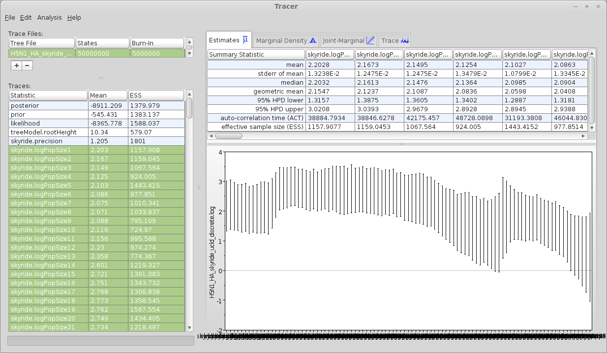

We can also have Tracer give a more detailed reconstruction of population history.

**Select 'GMRF Skyride Reconstruction...' from the 'Analysis' menu.**

**Input `H5N1_HA_skyride_ucld_discrete.trees` in the 'Trees Log File' dialog.**

By default this will give population size going backwards from the present.
We scale time more appropriately by setting the time of the most tip.

**Input `2005` as 'Age of youngest tip'.**

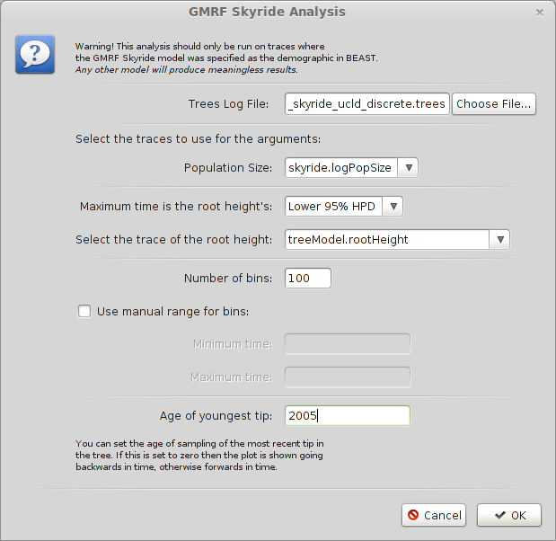

**Click on 'OK' to run the analysis.**

This will open a window with the following result:

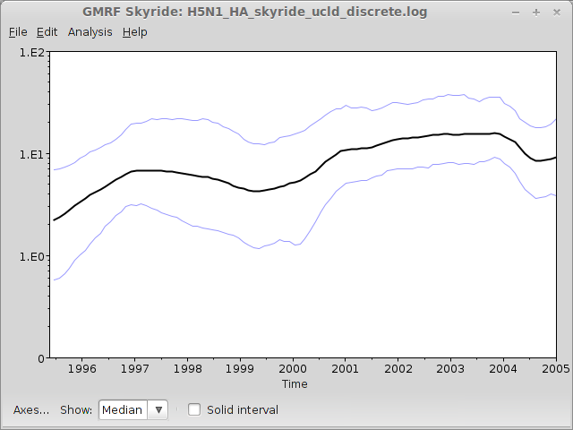

This shows population size through time as inferred by the skyride demographic model; it appears that there is some oscillatory behaviour, although a formal test of this should be done before firm conclusions can be drawn.

## Phylogeographic transition rates

The overall rate that one geographic location transitions to another location is measured by 'location.clock.rate', which is rather slow (0.76/year).

## Examine the trees

Here, we will use FigTree to display the phylogeny from the skyride analysis.
However, first we want to condense the posterior sample of trees to something more manageable.
For this, we will use the helper program TreeAnnotator that is distributed alongside BEAST.

**Open TreeAnnotator.**

Rather frustratingly, some BEAST programs use the minimum state number as burn-in (here 5 million), while others take a count of states to throw away (here 200).
TreeAnnotator takes the latter.

**To burn-in the first 5 million states, enter `200` for 'Burnin'.**

**Enter `H5N1_HA_skyride_ucld_discrete.trees` as 'Input Tree File' and enter `H5N1_HA_skyride_ucld_discrete.mcc` as 'Output file'.**

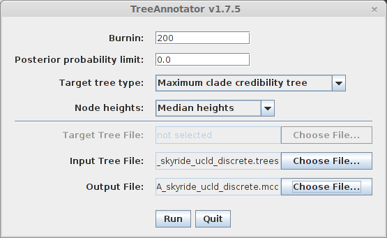

This will print out a single maximum clade credibility (MCC) tree to the file `H5N1_HA_skyride_ucld_discrete.mcc`. For convenience, I've included this file in the `output` directory.

## Tree statistics

BEAST also comes with a program, `treestat` that can calculate various statistics from a set of trees. Most of these tree statistics aren't entirely useful, as they're not tailored for serial samples. However, one that will be useful is the TMRCA for the MCC tree.

**Run `treestat`, select 'tMRCA' from the list of statistics, and move it to the right with the arrow. Then, check 'For the whole tree' and press 'OK'. Now press 'Process tree file' and select `H5N1_HA_skyride_ucld_discrete.mcc`. Save the log file as `H5N1_HA_skyride_ucld_discrete.mcc.treestat`.**

I have included `H5N1_HA_skyride_ucld_discrete.mcc.treestat` in the `output` directory. Looking at the output file, we see that the time to the most recent common ancestor is 10.29 years, which in calendar time is 2005-10.29=1994.71. We will use this number later on. Note that the TMRCA for the MCC tree is close, but not exactly the same as that we obtained from Tracer.

## Visualisation of the tree in FigTree

We can now open this MCC tree in FigTree.

**Open FigTree, select 'Open...' from the 'File' menu and choose the file `H5N1_HA_skyride_ucld_discrete.mcc`.**

This displays the tree with each taxon labeled.

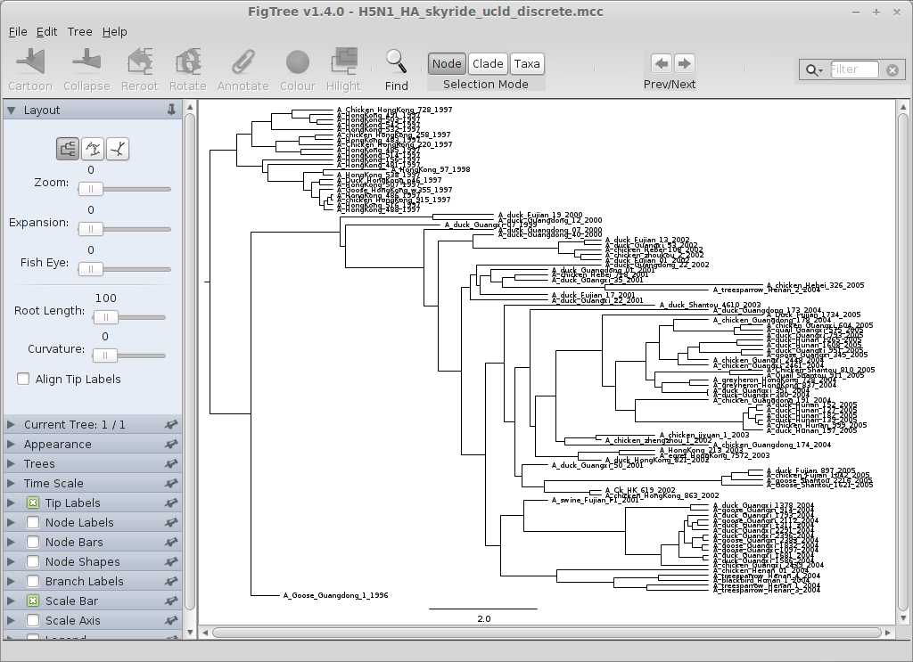

Note how taxa sequenced on the same year are aligned; in a more conservative analysis, we might incorporate uncertainty in the sampling times, or better yet, try to find out the exact sampling times.

We can get a better idea of the structure of the phylogeny with a bit of tree manipulation.

**Turn off 'Tip Labels' in the left-hand list.**

**Under 'Trees', turn on 'Order nodes' and choose 'decreasing'.**

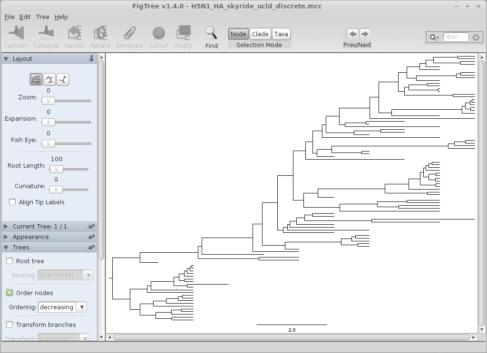

We can now see where the oscillatory pattern observed in the skyride comes from; there are two distinct clades separated by time.

We will annotate nodes with their geographic locations based on color.

**Turn on 'Node Shapes', enter `8` as 'Max size' and 'Colour by' location.**

This results in nodes colored by their most likely location. Click on 'Setup: Colour' to get a list of location colors, if you want to change this.

Including a legend will make this more clear.

**Turn on 'Legend' and choose 'location' for 'Attribute'.**

The resulting phylogenies shows early nodes in Hong Kong, then Guangdong, and to the rest of the regions.

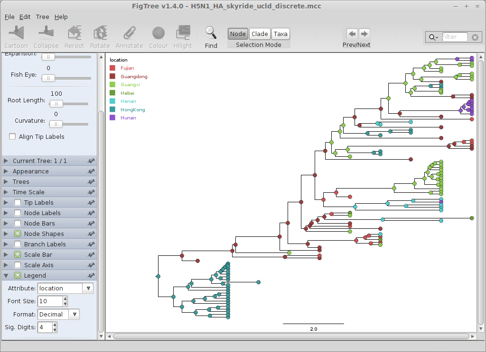

Adjustments can be made in the 'Layout' list to better see transitions between locations.

## Where is the root?

In the phylogeographic reconstruction, each node in each MCMC sample is annotated with a geographic location.
The certainty of the geographic reconstruction can be assessed by looking the distribution of node states across the MCMC.
The file `location.states.log` gives the reconstruction of the root node across the MCMC. We can read in this file into, say, R, and get the distribution of the location of the root.

```
> rootstate <- read.table('../output/location.states.log',skip=2,header=TRUE)
> burnin <- 200
> numstates <- dim(rootstate)[[1]]
> rootstate.trim <- rootstate[burnin:numstates,]
> as.data.frame.table(table(rootstate.trim$location)/(numstates-burnin))
       Var1        Freq
1    Fujian 0.073292615
2 Guangdong 0.155469184
3   Guangxi 0.124930594
4     Hebei 0.002776235
5     Henan 0.002776235
6  HongKong 0.639644642
7     Hunan 0.001665741
```

This shows that, while Hong Kong may be the most likely root (*under this model*), there is a fair amount of uncertainty.

## Geographic visualisations

In addition, the phylogeographic reconstruction can be visualised as a spread across the globe, in a map-centric fashion, rather than the previous tree-centric visualization.
To do this, we will run a small script on the MCC tree that will create a KML file that can be viewed in Google Earth.
This script is called `phylogeo.jar` as is located in the `scripts/` directory.
This analysis requires latitude and longitude coordinates for each location in a tab-delimited file.
I've included this as `data/H5N1_latlong.txt`.

To run the script, open a terminal window, navigate to the `output/` directory and run the following.

```
java -jar ../scripts/phylogeo.jar -coordinates ../data/H5N1_latlong.txt -annotation location -mrsd 2005 H5N1_HA_skyride_ucld_discrete.mcc H5N1_HA_skyride_ucld_discrete.kml
```

This specifies the `H5N1_latlong.txt` coordinates file, that the geographic character state is called `location`, that the most recent tip is at `2005` and that the MCC tree is the file `H5N1_HA_skyride_ucld_discrete.mcc`.
Running this script generates the file `H5N1_HA_skyride_ucld_discrete.kml`, which I've included in the `output/` directory.

**Open Google Earth and open the `H5N1_HA_skyride_ucld_discrete.kml` file.**

This will display well-supported transitions on the globe and includes their date of occurence.

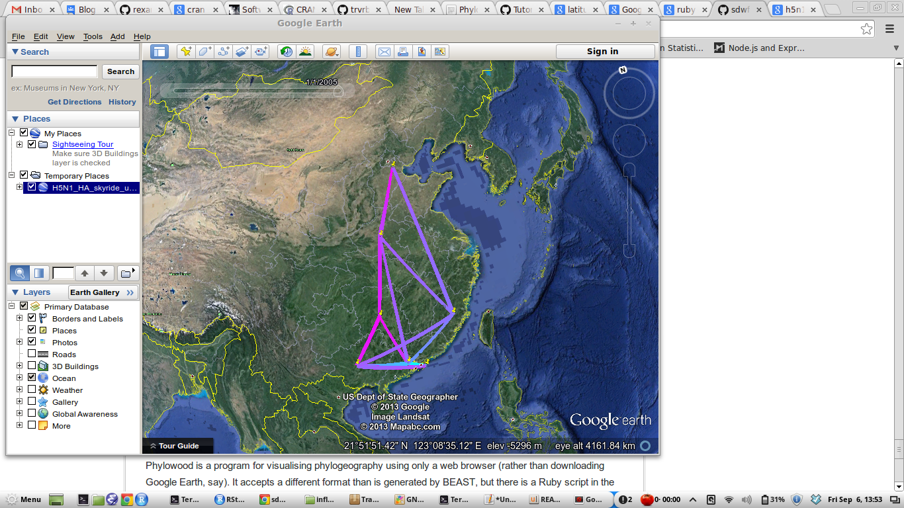


## Using Phylowood

Phylowood is a program for visualising phylogeography using only a web browser (rather than downloading Google Earth, say). It accepts a different format than is generated by BEAST, but there is a Ruby script in the Phylowood github repository, `beast-to-nhx-phylowood-discrete-location.rb`, that if you have Ruby installed, can convert the MCC tree generated by TreeAnnotator to NHX. If you change to the output directory, and run the following, this will generate a NHX file, `out.txt`.

```
ruby ../scripts/beast-to-nhx-phylowood-discrete-location.rb ./H5N1_HA_skyride_ucld_discrete.mcc
```

This is just a skeleton, which needs to be completed by hand (although if one were to do this all the time, one could automate the procedure). Firstly, the coordinates in the 'geo' block need to be included.

```
Begin geo;
	Dimensions ngeo=7;
	Coords
		Fujian 25.93 118.25,
		Guangdong 22.87 113.00,
		Guangxi 23.64 108.27,
		Hebei 39.32 116.70,
		Henan 33.88 113.49,
		HongKong 22.25 114.57,
		Hunan 27.38 111.53
	;
End;
```

One can find these e.g. using Google Maps. Next, we change the `phylowood` block, by adding in the start year, increasing the marker radius and modifying the description.

```
Begin phylowood;
	drawtype	pie
	modeltype	phylogeography
	areatype	discrete
	maptype	clean
	pieslicestyle	full
	piefillstyle	outwards
	timestart	1994.71
	timeunit	yr
	markerradius	300.0
	minareaval	0.0
	description	Discrete phylogeography of H5N1 influenza
End;
```

I have saved this file as `H5N1_HA_skyride_ucld_discrete.nhx`, which is in the `outputs` folder.

Next, go the the [Phylowood](http://mlandis.github.io/phylowood/) website, and paste in the contents of `H5N1_HA_skyride_ucld_discrete.nhx` into the window and press 'Load'.

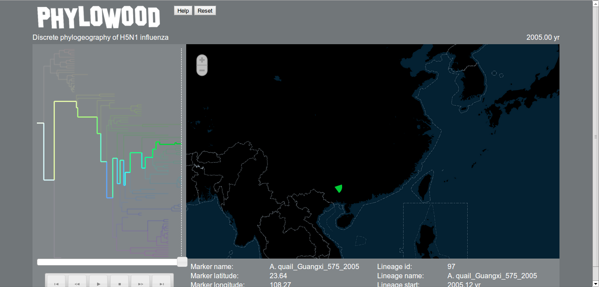

Now press the 'Play' button (the usual right arrow) under the tree, and watch! Further details can be found by pressing 'Help'.
